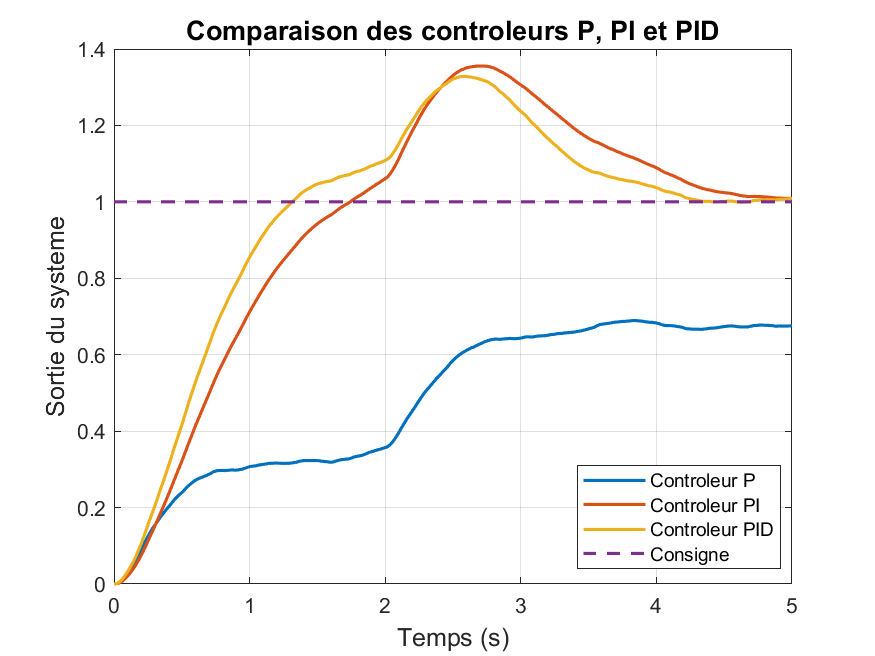

# DC Motor Speed Control — Modeling, Simulation and P/PI/PID Control


**Project Status:** Completed
**Environment:** MATLAB / Simulink
**Control Strategies:** P / PI / PID
**Main Focus:** DC Motor Speed Control
**Automation:** MATLAB Scripts



> **Final automated comparison of P, PI and PID controller performance under the selected operating conditions.**

## Quick Summary

This project implements and evaluates P, PI and PID controllers for DC motor speed control using MATLAB and Simulink. The study covers controller tuning, anti-windup, disturbance rejection, measurement noise filtering, actuator saturation, multi-setpoint validation, robustness analysis, and automated performance comparison.

---

## Project Overview

This project focuses on the mathematical modeling, simulation and closed-loop speed control of a DC motor using MATLAB and Simulink.

Three classical control strategies are implemented and compared:

* Proportional (P)
* Proportional-Integral (PI)
* Proportional-Integral-Derivative (PID)

The project was developed progressively, starting from a basic open-loop motor model and moving toward a complete closed-loop control system with controller tuning, anti-windup handling, controller comparison, external disturbance rejection, measurement noise analysis with derivative filtering, multi-setpoint verification, actuator saturation analysis, parametric robustness analysis and automated performance evaluation.

The project therefore covers the complete development process of a classical DC motor speed control system, from mathematical modeling to the automated quantitative comparison of P, PI and PID controllers.

---

## Key Results

The final automated P / PI / PID comparison was performed using the following controller gains:

| Controller | Kp | Ki | Kd   |
| ---------- | -: | -: | ---: |
| P          | 5  | 0  | 0    |
| PI         | 3  | 15 | 0    |
| PID        | 4  | 20 | 0.05 |

The main performance results are:

| Controller | Rise Time (s) | Settling Time (s) | Overshoot (%) | Peak   | Final Value | Steady-State Error (%) |
| ---------- | ------------: | ------------------: | -------------: | -----: | -----------: | -----------------------: |
| P          | NaN           | NaN                  | 0.000           | 0.6894 | 0.6760       | 32.395                    |
| PI         | 1.1383        | 4.5782               | 35.549          | 1.3555 | 1.0095       | 0.948                      |
| PID        | 0.8812        | 4.1548               | 32.810          | 1.3281 | 1.0096       | 0.959                      |

> **Note:** `NaN` indicates that the corresponding performance metric could not be determined by MATLAB's `stepinfo` criteria for the P controller's response, since it never enters the settling band required around the reference. This is not a computation error.

Under the selected operating conditions and controller gains, the PID controller provides the best overall compromise between transient speed, settling time and steady-state accuracy.

Compared with the PI controller, the PID controller reduces the rise time from approximately 1.14 s to 0.88 s and the settling time from approximately 4.58 s to 4.15 s. It also slightly reduces the overshoot from approximately 35.55% to 32.81%, while maintaining a steady-state error below 1%.

The PI controller also provides excellent steady-state accuracy, but with a slower transient response and a larger overshoot.

The P controller provides a direct and simple control action, but in the selected configuration it cannot accurately reach the reference and maintains a significant steady-state error of approximately 32.4%.

The complete performance table is automatically generated and stored in:

```text
Results/performance_table.csv
```

The final comparison figure of the three controller responses is available at:

```text
Figures/Comparaison_P_PI_PID.png
```

---

## Project Highlights

This project combines:

* Mathematical modeling of a DC motor.
* Open-loop and closed-loop analysis.
* P, PI and PID controller design and tuning.
* Manual and automatic PID tuning.
* Anti-windup implementation.
* External disturbance rejection analysis.
* Measurement noise analysis and derivative filtering.
* Multi-setpoint and actuator saturation verification.
* Parametric robustness analysis.
* Automated MATLAB simulations.
* Automated quantitative performance comparison.
* Professional project organization and a reproducible simulation workflow.

> **Note on naming:** this README uses American English throughout, except for file and folder names (`analyse_results.m`, `Comparaison_P_PI_PID.png`), which follow the actual names used in the repository. If you rename these files, update all references in this README accordingly.

---

## Objectives

While *Project Highlights* summarizes what the project technically covers, this section describes what the project aimed to demonstrate:

* Analyze the dynamic behavior of a DC motor in open and closed loop.
* Minimize the steady-state tracking error.
* Improve the transient response through appropriate controller design.
* Understand and mitigate the practical limitations of integral control (windup) and derivative control (noise sensitivity).
* Compare tuning strategies (manual tuning vs. automatic tuning) on an objective, quantitative basis.
* Evaluate controller robustness under realistic operating conditions — actuator saturation, external disturbances, measurement noise and parameter uncertainty.
* Develop an automated, reproducible simulation and analysis workflow using MATLAB.
* Generate quantitative performance indicators to support an objective comparison between the P, PI and PID strategies.

---

## System Modeling

The DC motor is modeled using its electrical and mechanical equations.

The main motor parameters used in the project are:

| Parameter | Description                      |
| --------- | --------------------------------- |
| R         | Armature resistance               |
| L         | Armature inductance                |
| J         | Rotor inertia                      |
| B         | Viscous friction coefficient       |
| K         | Motor torque / back-emf constant   |

The nominal values used in `parameters.m` are:

| Parameter | Value | Unit    |
| --------- | ----: | ------- |
| R         | 1.0   | Ω       |
| L         | 0.5   | H       |
| J         | 0.01  | kg·m²   |
| B         | 0.1   | N·m·s/rad |
| K         | 0.01  | V·s/rad |

The resulting motor transfer function is used to represent the relationship between the applied motor voltage and the motor angular speed.

The system is first studied in open loop and is then integrated into a closed-loop feedback control architecture.

The Simulink model used in this project is normalized. As a result, linearity and multi-setpoint tests are performed by varying the reference amplitude (0.5, 1 and 1.5) rather than using raw rpm values directly.

The mathematical modeling and corresponding representations developed during the project are documented in:

```text
Figures/modele_mathematique/
```

---

## Development Methodology

The project was developed progressively using MATLAB and Simulink.

The main development steps were:

1. DC motor mathematical modeling.
2. Open-loop simulation.
3. Closed-loop feedback implementation.
4. P controller implementation and gain tuning.
5. PI controller implementation and gain tuning.
6. PID controller implementation and gain tuning.
7. Anti-windup study for the integral action.
8. Controller tuning refinement using the PID Tuner.
9. Verification of the system's behavior across multiple reference amplitudes.
10. Actuator saturation verification.
11. Study of external disturbance effects.
12. Study of measurement noise effects and derivative filter tuning.
13. Parametric robustness analysis with motor parameter variation.
14. Automated P / PI / PID simulations.
15. Automated performance analysis.
16. Quantitative comparison of the three controllers.

The project was developed progressively by modifying and improving the control system step by step. The same closed-loop architecture was reused throughout several phases while additional elements and experiments were introduced.

Since several project phases used the same Simulink architecture, screenshots were only captured for significant modifications or new development steps. No duplicate screenshots were therefore created for phases using the same model structure.

Screenshots documenting the progressive development of the Simulink models are available in:

```text
Figures/Simulink_Development_Steps/
```

---

## Simulink Models

The project contains two main Simulink models representing the progressive development of the control system:

```text
Simulink/
├── DC_Motor_OpenLoop.slx
└── DC_Motor_ClosedLoop.slx
```

### `DC_Motor_OpenLoop.slx`

This is the initial and basic Simulink model used to start the project.

It represents the DC motor in an open-loop configuration and was used as the starting point for the modeling and simulation work.

This first model allowed the initial behavior of the DC motor to be studied before introducing feedback control.

It corresponds to the initial stage of the project, where the motor model and its open-loop response were first analyzed.

---

### `DC_Motor_ClosedLoop.slx`

This is the final and complete closed-loop Simulink model developed progressively throughout the project.

Starting from the closed-loop feedback architecture, this model incorporates the different developments carried out during the project, including:

* Feedback control of the DC motor speed.
* Implementation and comparison of the P, PI and PID controllers.
* Anti-windup protection on the integral action.
* A second scope placed between the PID controller and the motor to monitor the control signal and verify actuator saturation.
* Integration of an external disturbance.
* Integration of measurement noise, with a filtered derivative term for noise attenuation.
* Evaluation of the controllers under different operating conditions and reference amplitudes.
* Automated simulations and performance analysis.

The `DC_Motor_ClosedLoop.slx` model represents the final closed-loop control architecture developed throughout the project — incorporating feedback control, the P/PI/PID controllers, anti-windup protection, external disturbance and measurement noise. Additional analyses, including multi-setpoint testing, robustness evaluation and automated controller comparison, are carried out using dedicated MATLAB scripts and simulation configurations built around this model, rather than being embedded simultaneously within the Simulink model itself.

In short: `DC_Motor_OpenLoop.slx` represents the initial starting point of the study, while `DC_Motor_ClosedLoop.slx` represents the final and complete control architecture developed throughout the project. The different stages of this development are documented through screenshots available in:

```text
Figures/Simulink_Development_Steps/
```

These screenshots illustrate the progressive evolution of the system, from the initial open-loop model to the final closed-loop configuration with the different elements introduced throughout the project.

---

## Control Strategies

### P Controller

The proportional controller generates a control action proportional to the tracking error.

The P controller offers a simple and direct control strategy. However, it cannot completely eliminate the steady-state error in the studied system.

**Gain tuning.** Several values of Kp were tested. Increasing Kp:

* decreases the rise time;
* reduces the steady-state error;
* makes the control action more aggressive;
* can increase overshoot and reduce the stability margin at sufficiently high gains.

Increasing Kp reduces the steady-state error, but the P controller cannot eliminate it completely. This confirms the fundamental limitation of a pure P controller: it cannot fully cancel the tracking error in the studied system.

The gain retained for the automated P/PI/PID comparison is:

```text
Kp = 5
Ki = 0
Kd = 0
```

In the final comparison, the P controller reaches a final value of approximately 0.676 for a unit reference, resulting in a steady-state error of approximately 32.4%. Rise time and settling time are reported as NaN by `stepinfo`, since the response never enters the settling band required around the reference.

---

### PI Controller

The PI controller combines proportional and integral actions.

The integral term accumulates the tracking error over time and allows the controller to significantly reduce, or even eliminate, the steady-state error.

However, excessive integral action can increase overshoot and settling time if the controller is not properly tuned, and can lead to integrator windup when the actuator saturates (see the *Integrator Windup and Anti-Windup* section below).

**Gain tuning.** Two representative tuning cases were compared:

| Case                                | Gains             | Overshoot | Comment                                                                    |
| ------------------------------------ | ----------------- | --------: | ---------------------------------------------------------------------------- |
| Poorly tuned                         | Kp = 10, Ki = 50   | 21.43 %   | A high integral gain degrades the transient response                        |
| Retained for a dedicated PI study    | Kp = 10, Ki = 10   | 0 %       | Very low steady-state error (≈ 0.0242), stable response, good compromise     |

As Ki increases, the steady-state error progressively decreases until it becomes nearly zero, improving accuracy. However, an excessively large Ki can cause significant overshoot and, if pushed too far, instability. A compromise between accuracy, speed and stability is therefore necessary.

The gains retained for the automated P/PI/PID comparison are:

```text
Kp = 3
Ki = 15
Kd = 0
```

These gains are used specifically for the final comparative benchmark presented in the [Performance Comparison](#performance-comparison) section.

#### Integrator Windup and Anti-Windup

When the controller's output voltage exceeds what the actuator can physically supply, the actuator saturates. For example, if the PI controller computes an 80 V command while the motor can only accept up to ±24 V, the actuator remains saturated at its limit.

While the actuator is saturated, the integral term can continue accumulating the tracking error even though the actuator can no longer increase its output — a phenomenon known as **integrator windup**.

**Without anti-windup:**
* The actuator saturates.
* The integral term keeps accumulating error.
* The integrator becomes "overcharged."
* The accumulated integral action can produce a large overshoot.
* The system may take longer to return to the reference.

In the high-gain configuration tested (Kp = 100, Ki = 200), the system showed strong saturation effects and a peak of approximately 1.3.

**With anti-windup:**
* The controller detects actuator saturation.
* The integral accumulation is limited or frozen.
* The integral action does not keep growing excessively while the actuator cannot respond.
* The system recovers more efficiently once the output leaves saturation.

The anti-windup mechanism therefore improves the integral controller's behavior under actuator saturation. Screenshots and figures documenting this study are available in the `Figures/` directory.

---

### PID Controller

The PID controller combines proportional, integral and derivative actions.

The proportional term reacts to the current tracking error.

The integral term accumulates the error over time and reduces the steady-state error.

The derivative term reacts to the variation of the error and helps improve the transient response by adding predictive damping.

The PID controller is evaluated in this project in terms of response speed, settling time, overshoot and steady-state accuracy.

**Manual gain tuning.** The effect of the derivative gain Kd was tested at Kp = 10, Ki = 10:

| Kd  | Rise Time      | Overshoot | Comment                                                        |
| --- | -------------- | --------: | ------------------------------------------------------------------ |
| 0.1 | 0.2702 s       | 0 %       | Fast response, near-zero steady-state error, best compromise      |
| 0.5 | > 2.27 s       | 0 %       | Response becomes significantly slower                             |
| 1   | ≈ 4 s settling | 0 %       | Excessive damping degrades speed                                  |

The best manually-tuned configuration obtained during this dedicated PID tuning study was:

```text
Kp = 10
Ki = 10
Kd = 0.1
```

This configuration achieved:

* Rise time = 0.2702 s
* Settling time = 1.2403 s
* Overshoot = 0 %
* Near-zero steady-state error

However, this configuration is not the one used for the final automated P/PI/PID performance benchmark. For the final automated controller comparison, a separate set of gains was retained:

```text
Kp = 4
Ki = 20
Kd = 0.05
```

These gains are used specifically for the final comparative benchmark presented in the [Performance Comparison](#performance-comparison) section. The distinction between the dedicated tuning study and the final benchmark allows the different tuning experiments to be documented while keeping a consistent final comparison between the three controller types.

#### Automatic Tuning with the PID Tuner

As an alternative to manual tuning and to the Ziegler–Nichols method, Simulink's **PID Tuner** was also used. The Ziegler–Nichols method was not used in this project, as it requires locating the critical gain and inducing sustained oscillations, which was judged impractical for the scope of this first project.

The PID Tuner produced the following gains:

```text
P = 21.23
I = 36.03
D = 1.815
```

These gains are broadly consistent with the trends observed during the manual tuning experiments, although the numerical values differ, since the PID Tuner relies on an automatic optimization procedure rather than manual trial-and-error:

* The proportional gain is relatively high, enabling a fast response.
* The integral gain is lower than in the earlier over-tuned configuration, reducing the risk of excessive overshoot.

> **Note:** this comparison assumes the PID Tuner's `P`, `I`, `D` fields correspond directly to `Kp`, `Ki`, `Kd` in the parallel form used elsewhere in this project. Simulink's PID Controller block can also be configured in other forms (e.g. `Kp`, `Ti`, `Td`), which are not numerically comparable to `Kp`, `Ki`, `Kd` without conversion. Verify the block's parameter form before comparing these values directly.
* The derivative gain provides additional damping.

Validating this tuning in Simulink with `stepinfo` gave the following results:

| Criterion           | Result          | Evaluation         |
| --------------------- | ---------------- | -------------------- |
| Rise time              | 0.5340 s         | Fast                 |
| Settling time          | 0.8297 s         | Very good             |
| Overshoot              | 1.6708 %         | Excellent             |
| Steady-state error     | 1.7028 × 10⁻⁵    | Practically zero      |

Compared to the selected P controller configuration, the PID Tuner configuration has a slightly slower rise time, but significantly improves steady-state accuracy, overshoot and settling behavior. This demonstrates the ability of automatic tuning to deliver a satisfactory overall compromise for the studied speed control system.

---

## Multi-Setpoint and Actuator Saturation Verification

Since the Simulink model is normalized, multi-setpoint tests were performed using reference amplitudes of:

```text
0.5
1
1.5
```

instead of using raw motor speed values directly.

For each reference amplitude, the controller's response was evaluated and the actuator command was monitored. A second scope was placed between the PID controller and the motor to observe the control signal and verify the actuator's voltage limit.

**Main observations:**

* Rise time remains relatively constant across all tested reference amplitudes.
* Transient behavior remains comparable across all tested operating points.
* Overshoot stays below approximately 2% in the dedicated multi-setpoint PID study.
* Steady-state error remains practically zero.
* The control signal stayed within the actuator's specified voltage limits (±24 V) under the tested multi-setpoint conditions.

These results suggest that the controlled system exhibits relatively consistent behavior across the tested operating range, with similar tracking performance for the selected reference amplitudes. This consistency across setpoints does not by itself demonstrate strict system linearity, particularly given the presence of saturation, anti-windup, disturbance and noise in the full closed-loop model — but it does indicate that the PID controller performs predictably over this operating range.

---

## Disturbance and Measurement Noise

The control system was progressively evaluated under different operating conditions.

The study includes:

* Normal operation without disturbance.
* Operation with an external disturbance.
* Operation with measurement noise.
* Operation with both external disturbance and measurement noise.

These experiments were used to evaluate the robustness of the control strategies under more realistic operating conditions.

### External Disturbance Rejection

A resistive torque disturbance was applied to the motor, and the behavior of the P, PI and PID configurations was observed.

**Main observations:**

* In the studied configuration, the PID controller allows a faster return to the reference value than the PI controller.
* The PI controller also benefits from its integral action, which helps compensate for the persistent tracking error introduced by the disturbance.
* The P controller shows a persistent steady-state error after the disturbance, since it has no integral mechanism to accumulate and compensate for the error over time.

As a result, a pure P controller is generally insufficient for applications requiring precise speed tracking in the presence of continuous disturbances.

### Measurement Noise and Derivative Filtering

Measurement noise was added to the speed feedback signal. The controller therefore receives a measured speed containing both the actual motor speed and the measurement noise.

In the presence of noise:

* the measured speed becomes more oscillatory;
* the controller reacts to the noise-induced variations;
* the control signal becomes more unstable.

The derivative term is particularly sensitive to measurement noise, since it reacts to rapid variations of the error signal. Because noise can vary quickly from sample to sample, the derivative action can amplify these high-frequency variations and produce an oscillatory control signal.

To mitigate this effect, a filtered derivative action was introduced, and several filter coefficients (N) were tested:

| N   | Effect                                                                                            |
| --- | ---------------------------------------------------------------------------------------------------- |
| 10  | Strong filtering and a smoother control signal, but the derivative action is attenuated and the response is slightly slower |
| 50  | Best compromise between noise attenuation and dynamic response                                        |
| 100 | Weaker filtering; high-frequency oscillations become more noticeable                                  |

The retained value is:

```text
N = 50
```

which offers the best compromise among the tested configurations.

**Conclusion:** the measurement noise study demonstrates that the PID controller is more sensitive to measurement noise than the P and PI controllers, mainly because of the derivative action. The derivative filter significantly reduces the effect of measurement noise while preserving acceptable dynamic performance.

The corresponding simulation figures and screenshots documenting the different stages are available in the `Figures/` directory, and the progressive development of the Simulink architecture is documented in:

```text
Figures/Simulink_Development_Steps/
```

---

## Robustness Analysis

To evaluate the sensitivity of the PID controller to modeling uncertainty, an automated robustness analysis was performed by varying the motor parameters.

The armature resistance R and the rotor inertia J were varied from **−30% to +30%** around their nominal values. The resulting robustness data were stored in a robustness table.

**Conclusion:** the analysis shows that the PID controller maintains satisfactory performance despite moderate variations in the motor parameters. Variations in resistance and inertia can affect transient characteristics — notably the rise time and overshoot. The simulations indicate satisfactory robustness of the PID controller across the tested parameter range, though this should be understood as an indication from the tested cases rather than a formal stability guarantee.

---

## Automated Simulation and Analysis

The final stage of the project includes MATLAB scripts for automating the simulation and performance analysis of the P, PI and PID controllers.

The main scripts are:

```text
Matlab/
├── parameters.m
├── run_simulations.m
├── analyse_results.m
├── performance_analysis.m
└── params.mat
```

### Parameter Configuration

The file:

```text
parameters.m
```

contains the main motor, simulation and controller parameters used in the project. It is used to initialize the required variables before running the simulations.

The corresponding parameter data are stored in:

```text
Matlab/params.mat
```

### Automated Simulation

The script:

```text
run_simulations.m
```

automatically runs the simulations for the three controllers and saves the obtained results. The underlying Simulink model is preserved and is neither modified nor deleted by the automation process.

The simulation results are stored in:

```text
Results/
├── results_P.mat
├── results_PI.mat
└── results_PID.mat
```

### Result Analysis

The script:

```text
analyse_results.m
```

loads and compares the simulation results for the P, PI and PID controllers. It computes the main response characteristics and generates the final comparison figure.

The comparison figure is saved as:

```text
Figures/Comparaison_P_PI_PID.png
```

### Performance Analysis

The script:

```text
performance_analysis.m
```

calculates quantitative performance indicators such as:

* Rise Time (Tr)
* Settling Time (Ts)
* Overshoot (Mp)
* Steady-state error (Ess)
* Final value
* Peak value

The resulting performance table is exported as:

```text
Results/performance_table.csv
```

This table provides an objective numerical comparison of the three control strategies.

---

## Performance Comparison

The final automated simulation results obtained for the selected controller parameters are summarized below.

| Controller | Kp | Ki | Kd   | Rise Time (s) | Settling Time (s) | Overshoot (%) | Peak   | Final Value | Steady-State Error (%) |
| ---------- | -: | -: | ---: | ------------: | ------------------: | -------------: | -----: | -----------: | -----------------------: |
| P          | 5  | 0  | 0    | NaN           | NaN                  | 0.000           | 0.6894 | 0.6760       | 32.395                    |
| PI         | 3  | 15 | 0    | 1.1383        | 4.5782               | 35.549          | 1.3555 | 1.0095       | 0.948                      |
| PID        | 4  | 20 | 0.05 | 0.8812        | 4.1548               | 32.810          | 1.3281 | 1.0096       | 0.959                      |

> **Note:** `NaN` indicates that the corresponding performance metric could not be determined by MATLAB's `stepinfo` criteria for the P controller's response, since it never enters the settling band required around the reference. This is not a computation error.

### Interpretation

The P controller presents a significant steady-state error of approximately 32.4%, with a final value of approximately 0.676 for a unit reference. Rise time and settling time are reported as NaN by `stepinfo`, since the response never enters the settling band required around the reference.

The PI controller significantly reduces the steady-state error to approximately 0.95%. However, its settling time is approximately 4.58 s and its overshoot reaches approximately 35.55%.

The PID controller provides a faster transient response than the PI controller: its rise time is approximately 0.88 s, compared with 1.14 s for the PI controller — an improvement of about 22.6%. Its settling time is also slightly lower (4.1548 s vs. 4.5782 s), and its overshoot is slightly reduced (32.81% vs. 35.55%), while its steady-state error remains below 1%.

Under the selected operating conditions and controller gains, the PID controller therefore offers the best overall compromise between transient speed, settling behavior and steady-state accuracy. The residual overshoot suggests that further gain optimization could reduce oscillations and settling time if required.

### When to Prefer PI over PID

The PI controller can be preferred when the measurement environment is significantly affected by noise. The derivative term of the PID controller is sensitive to high-frequency measurement noise and can amplify noise-induced variations in the control signal.

In such conditions, the PI controller can provide a simpler and more robust solution. In the final comparison, the PI controller achieves a steady-state error of approximately 0.948%, which is already very low. Therefore, if the additional transient performance offered by the derivative action is not required, the PI controller may be preferred for its simpler structure and lower sensitivity to measurement noise.

### Why Avoid a P Controller Alone in Practice

A pure P controller cannot eliminate the steady-state error in the studied system. In the final comparison, the P controller shows:

```text
Final value ≈ 0.676
Steady-state error ≈ 32.4%
```

This error becomes particularly significant when a persistent external disturbance is applied. Since the P controller has no integral action, it cannot accumulate the error over time to compensate for a sustained disturbance. As a result, a pure P controller is generally unsuitable for applications requiring precise speed tracking and strong rejection of persistent disturbances.

The final comparison figure is available in:

```text
Figures/Comparaison_P_PI_PID.png
```

---

## Project Structure

```text
DC_Motor_PID_Project/
│
├── README.md
├── CHANGELOG.md
├── LICENSE
├── .gitignore
│
├── Simulink/
│   ├── DC_Motor_OpenLoop.slx
│   └── DC_Motor_ClosedLoop.slx
│
├── Matlab/
│   ├── parameters.m
│   ├── run_simulations.m
│   ├── analyse_results.m
│   ├── performance_analysis.m
│   └── params.mat
│
├── Figures/
│   │
│   ├── Simulink_Development_Steps/
│   │   └── ...
│   │
│   ├── modele_mathematique/
│   │   └── ...
│   │
│   ├── Comparaison_P_PI_PID.png
│   │
│   └── ...
│
├── Results/
│   ├── results_P.mat
│   ├── results_PI.mat
│   ├── results_PID.mat
│   └── performance_table.csv
│
└── docs/
    └── ...
```

The `Figures/` directory contains the visual documentation and results of the project:

* `Simulink_Development_Steps/` contains screenshots documenting the progressive development of the Simulink models and the different stages of the project.
* `modele_mathematique/` contains figures related to the mathematical modeling of the DC motor.
* `Comparaison_P_PI_PID.png` presents the final comparison of the P, PI and PID controller responses.
* The remaining figures document the simulation results obtained throughout the different project phases, including the anti-windup, multi-setpoint, disturbance rejection, measurement noise/filtering, and robustness experiments.

---

## Requirements

The project requires:

* MATLAB
* Simulink
* Control System Toolbox

The project was developed and tested using MATLAB/Simulink. Compatibility with other MATLAB versions may depend on the specific Simulink blocks and functions used.

---

## How to Run the Project

### 1. Clone the repository

Clone the project repository and open the project root directory:

```text
DC_Motor_PID_Project/
```

### 2. Open MATLAB and set the working directory

Open MATLAB and set the current folder to:

```text
DC_Motor_PID_Project/Matlab/
```

> The scripts (`run_simulations.m`, `analyse_results.m`, `performance_analysis.m`) reference the `Simulink/`, `Results/` and `Figures/` folders using relative paths. Running them from any other current folder may cause file-not-found errors.

### 3. Load the project parameters

Run:

```matlab
parameters
```

This initializes the main motor, simulation and controller parameters.

### 4. Run the automated simulations

Run:

```matlab
run_simulations
```

The script automatically runs the P, PI and PID simulations and saves the results in:

```text
Results/
```

### 5. Analyze the simulation results

Run:

```matlab
analyse_results
```

The script generates the final comparison figure:

```text
Figures/Comparaison_P_PI_PID.png
```

### 6. Generate the performance table

Run:

```matlab
performance_analysis
```

The resulting quantitative performance table is saved as:

```text
Results/performance_table.csv
```

Generated figures are saved in:

```text
Figures/
```

---

## Technologies

* MATLAB
* Simulink
* Control System Toolbox
* MATLAB scripting
* Classical control theory
* DC motor modeling
* Feedback control systems
* PID tuning and anti-windup techniques
* Disturbance rejection
* Measurement noise filtering
* Parametric robustness analysis

---

## Conclusion

This project demonstrates the complete development of a DC motor speed control system, from mathematical modeling to closed-loop control and automated performance evaluation.

The progressive development starts with a basic open-loop DC motor model and evolves into a complete closed-loop control architecture, integrating P, PI and PID controllers, anti-windup protection, external disturbance rejection, measurement noise analysis with derivative filtering, multi-setpoint verification, actuator saturation analysis, parametric robustness evaluation, and automated performance comparison.

The comparison of the three control strategies demonstrates the importance of controller selection and tuning:

* The **P controller** offers a simple and direct control action, but retains a significant steady-state error of approximately 32.4% in the final benchmark, and cannot adequately compensate for sustained disturbances.
* The **PI controller** significantly reduces the steady-state error to approximately 0.95%, demonstrating the effectiveness of the integral action for accurate reference tracking. However, in the selected configuration, it presents a slower transient response and a larger overshoot.
* The **PID controller** offers the best overall compromise between response speed, settling time and steady-state accuracy under the selected operating conditions and gains. It reduces the rise time to approximately 0.88 s and the settling time to approximately 4.15 s, while maintaining a steady-state error below 1%. It is also more sensitive to measurement noise due to its derivative action — a sensitivity mitigated by introducing a filtered derivative term, with N = 50 offering the best compromise among the tested filter configurations.

The project also evaluates external disturbance rejection, measurement noise, actuator saturation, multi-setpoint behavior, and parametric robustness with ±30% variations of the motor resistance and rotor inertia.

Overall, the project demonstrates the transition from a basic open-loop DC motor model to a complete, progressively developed control system, combining classical control theory, MATLAB scripting, Simulink modeling, automated simulation, quantitative performance evaluation and robustness analysis.

---

## Author

**Imane Ghbalou**

Academic engineering project — 2026
