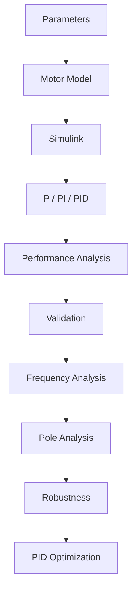
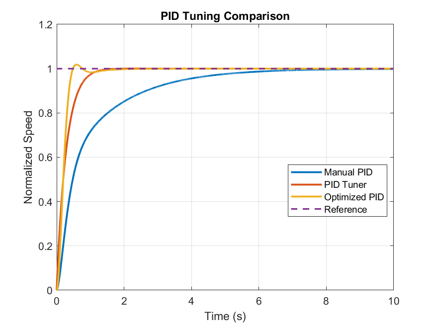
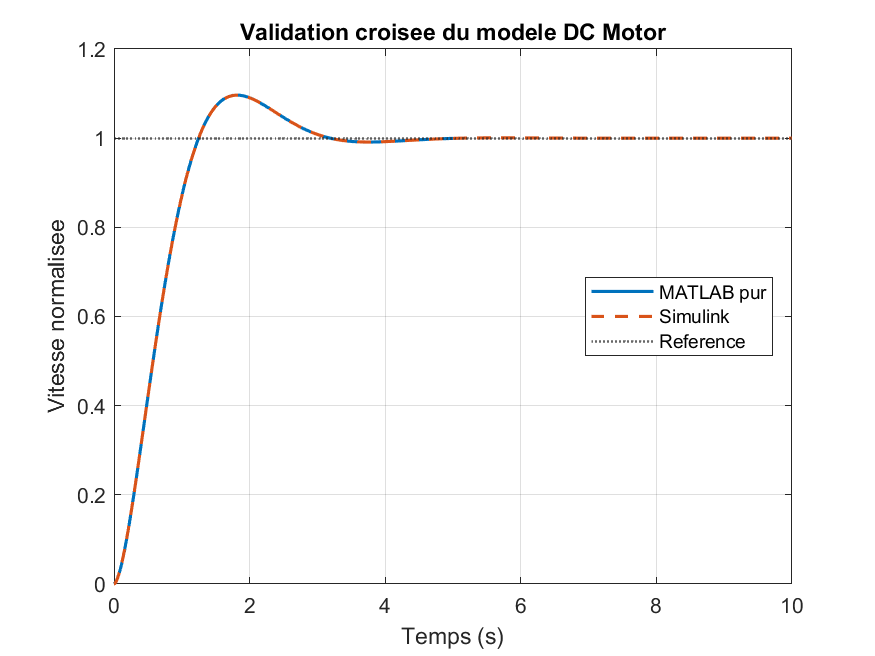
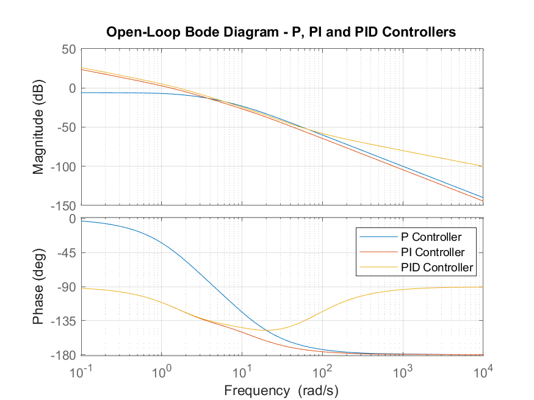
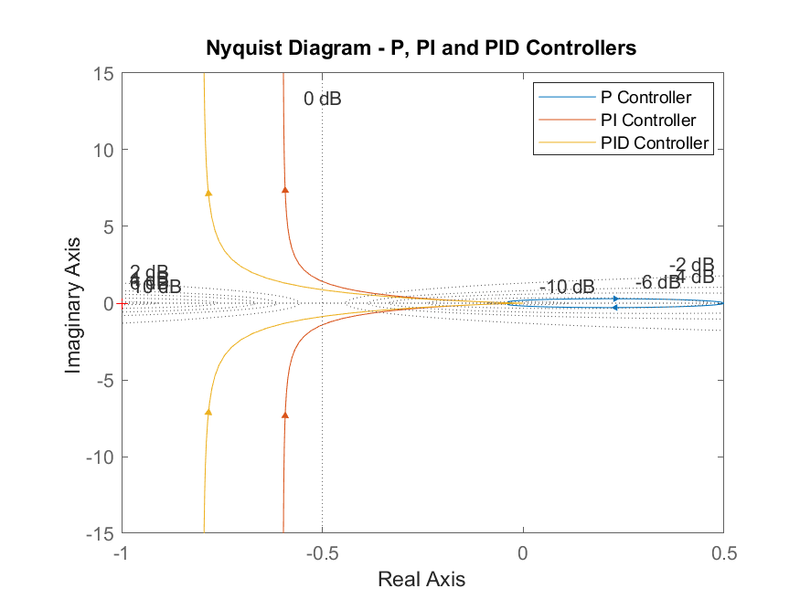
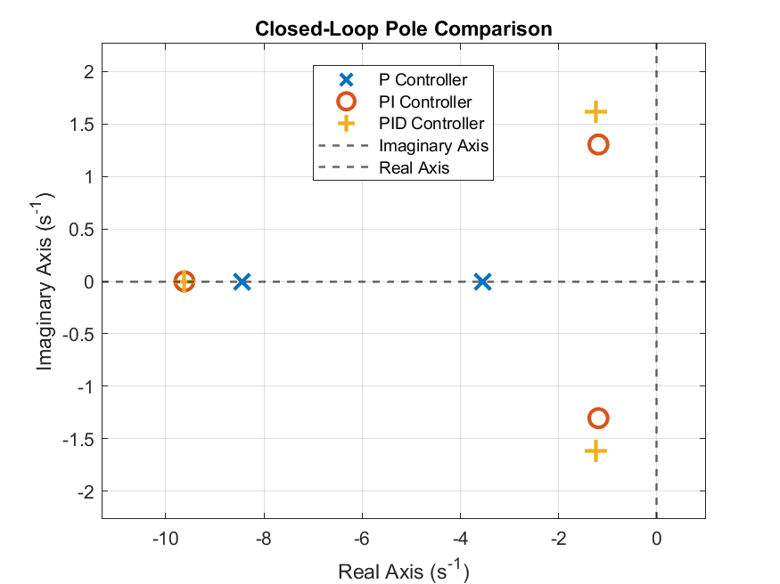

# DC Motor Speed Control — Modeling, Simulation and P/PI/PID Control


**Project Status:** Completed
**Final Development Stage:** Automated PID Optimization and Comprehensive Validation
**Environment:** MATLAB / Simulink
**Control Strategies:** P / PI / PID
**Main Focus:** DC Motor Speed Control and PID Optimization
**Automation:** MATLAB Scripts


> **Final automated comparison of P, PI and PID controller performance under the selected operating conditions.**

## Table of Contents

- [Project Overview](#project-overview)
- [Key Results](#key-results)
- [Objectives](#objectives)
- [System Modeling](#system-modeling)
- [Development Methodology](#development-methodology)
- [Project Workflow](#project-workflow)
- [Simulink Models](#simulink-models)
- [Control Strategies](#control-strategies)
- [Multi-Setpoint and Actuator Saturation Verification](#multi-setpoint-and-actuator-saturation-verification)
- [Disturbance and Measurement Noise](#disturbance-and-measurement-noise)
- [Robustness Analysis](#robustness-analysis)
- [Automated MATLAB Workflow](#automated-matlab-workflow)
- [Generated Outputs](#generated-outputs)
- [Repository Outputs](#repository-outputs)
- [Automated PID Optimization](#automated-pid-optimization)
- [Automated PID Optimization Workflow](#automated-pid-optimization-workflow)
- [Manual PID vs. PID Tuner vs. Optimized PID](#manual-pid-vs-pid-tuner-vs-optimized-pid)
- [Cross-Validation: MATLAB vs. Simulink](#cross-validation-matlab-vs-simulink)
- [Performance Comparison](#performance-comparison)
- [Frequency-Domain Analysis](#frequency-domain-analysis)
- [Pole-Based Stability Analysis](#pole-based-stability-analysis)
- [Final Project Results](#final-project-results)
- [Project Structure](#project-structure)
- [Requirements](#requirements)
- [How to Run the Project](#how-to-run-the-project)
- [Technologies](#technologies)
- [Future Work](#future-work)
- [Conclusion](#conclusion)
- [Author](#author)

---

## Project Overview

This project presents the mathematical modeling, simulation, analysis and closed-loop speed control of a DC motor using MATLAB and Simulink.

Three classical control strategies are implemented and compared:

* Proportional (P)
* Proportional-Integral (PI)
* Proportional-Integral-Derivative (PID)

The project progressively evolves from an open-loop motor model to a complete closed-loop control system incorporating controller tuning, anti-windup, actuator saturation, external disturbance rejection, measurement noise analysis, derivative filtering, multi-setpoint verification, parametric robustness analysis and automated performance evaluation.

Three PID tuning approaches are also investigated:

* Manual PID tuning.
* Automatic tuning using Simulink PID Tuner.
* Automated numerical PID gain optimization using MATLAB.

The project additionally includes frequency-domain analysis, pole-based stability analysis and cross-validation between an analytical MATLAB closed-loop model and its equivalent Simulink implementation.

The complete workflow therefore combines classical control theory, MATLAB scripting, Simulink simulation, automated quantitative analysis, robustness evaluation and numerical PID optimization.

---

## Key Results

The final automated P / PI / PID comparison was performed using the following controller gains:

> These gains define the final, normalized benchmark configuration used to compare the three controller types on a consistent basis. They do not necessarily correspond to the best gains found for each controller during the individual manual tuning experiments described later in this README (e.g. the manually-tuned PID in the [PID Controller](#pid-controller) section) — see that section for the distinction.

| Controller | Kp | Ki | Kd   |
| ---------- | -: | -: | ---: |
| P          | 5  | 0  | 0    |
| PI         | 3  | 15 | 0    |
| PID        | 4  | 20 | 0.05 |

Under these gains, the PID controller provides the best overall compromise between transient speed, settling behavior and steady-state accuracy among the three controller structures — the P controller retains a significant steady-state error, while the PI controller trades a slower transient response and larger overshoot for accurate steady-state tracking.

The full performance table and interpretation are presented in [Performance Comparison](#performance-comparison).

The main generated outputs are:

```text
Results/performance_table.csv
Figures/Comparaison_P_PI_PID.png
```

---

## Objectives

This section describes what the project aimed to demonstrate, as distinct from the results themselves:

* Analyze the dynamic behavior of a DC motor in open and closed loop.
* Minimize the steady-state tracking error.
* Improve the transient response through appropriate controller design.
* Understand and mitigate the practical limitations of integral control (windup) and derivative control (noise sensitivity).
* Evaluate controller robustness under realistic operating conditions — actuator saturation, external disturbances, measurement noise and parameter uncertainty.
* Develop an automated, reproducible simulation and analysis workflow using MATLAB.
* Generate quantitative performance indicators to support an objective comparison between the P, PI and PID strategies.
* Compare manual PID tuning, Simulink PID Tuner and numerical PID gain optimization on a quantitative basis.
* Evaluate the trade-off between response speed, overshoot, settling behavior and steady-state accuracy for different tuning strategies.

---

## System Modeling

The DC motor is modeled using its electrical and mechanical equations.

The main motor parameters used in the project are:

| Parameter | Description                      |
| --------- | --------------------------------- |
| R         | Armature resistance               |
| L         | Armature inductance                |
| J         | Rotor inertia                      |
| B         | Viscous friction coefficient       |
| K         | Motor torque / back-emf constant   |

The nominal values used in `parameters.m` are:

| Parameter | Value | Unit    |
| --------- | ----: | ------- |
| R         | 1.0   | Ω       |
| L         | 0.5   | H       |
| J         | 0.01  | kg·m²   |
| B         | 0.1   | N·m·s/rad |
| K         | 0.01  | V·s/rad |

The resulting motor transfer function is used to represent the relationship between the applied motor voltage and the motor angular speed.

The system is first studied in open loop and is then integrated into a closed-loop feedback control architecture.

The Simulink model used in this project is normalized. As a result, linearity and multi-setpoint tests are performed by varying the reference amplitude (0.5, 1 and 1.5) rather than using raw rpm values directly.

> **Normalization note:** The motor reference speed was initially defined in rpm during the modeling phase (e.g. `Speed_ref = 1000 rpm` as a nominal value in `parameters.m`). For the final normalized Simulink performance benchmark, this reference is scaled to `r = 1`, and all performance metrics reported in the automated P/PI/PID comparison (final value, peak, steady-state error, etc.) are therefore expressed in normalized units rather than directly in rpm. If you need results in rpm, multiply the normalized output by the nominal reference speed used in `parameters.m`.

The mathematical modeling and corresponding representations developed during the project are documented in:

```text
Figures/modele_mathematique/
```

---

## Development Methodology

The project was developed progressively using MATLAB and Simulink.

The main development steps were:

1. DC motor mathematical modeling.
2. Open-loop simulation.
3. Closed-loop feedback implementation.
4. P controller implementation and gain tuning.
5. PI controller implementation and gain tuning.
6. PID controller implementation and gain tuning.
7. Integrator windup and anti-windup analysis.
8. Actuator saturation analysis.
9. External disturbance rejection analysis.
10. Measurement noise analysis.
11. Derivative filter tuning.
12. Multi-setpoint verification.
13. Parametric robustness analysis.
14. Automated P / PI / PID simulations.
15. Automated quantitative performance analysis.
16. P / PI / PID controller comparison.
17. MATLAB / Simulink cross-validation.
18. Frequency-domain analysis.
19. Pole-based stability analysis.
20. Automatic PID tuning using Simulink PID Tuner.
21. Automated PID gain optimization.
22. Comparative analysis of manual, PID Tuner and optimized PID configurations.
23. Final comprehensive analysis and validation.

> The numbered phases summarize the progressive development of the project and the main analyses performed throughout the study.

The project was developed progressively by modifying and improving the control system step by step. The same closed-loop architecture was reused throughout several phases while additional elements and experiments were introduced.

The final closed-loop system includes feedback control, PID control, actuator saturation, anti-windup protection, external disturbance, measurement noise and derivative filtering.

The automated MATLAB scripts were subsequently used to perform repeated simulations, evaluate controller performance and optimize the PID gains.

Since several project phases used the same Simulink architecture, screenshots were only captured for significant modifications or new development steps. No duplicate screenshots were therefore created for phases using the same model structure.

Screenshots documenting the progressive development of the Simulink models are available in:

```text
Figures/Simulink_Development_Steps/
```

---

## Project Workflow

The overall project workflow, from parameter definition to automated PID optimization, is summarized below:



This diagram provides a high-level view of the project; the detailed sequence of development steps is described in [Development Methodology](#development-methodology) above, and the dedicated optimization sub-workflow is detailed separately in [Automated PID Optimization Workflow](#automated-pid-optimization-workflow).

---

## Simulink Models

The project contains two main Simulink models representing the progressive development of the control system, together with a dedicated validation model:

```text
Simulink/
├── open_loop.slx
├── DC_Motor_ClosedLoop.slx
└── Validation.slx
```

### `open_loop.slx`

This is the initial and basic Simulink model used to start the project.

It represents the DC motor in an open-loop configuration and was used as the starting point for the modeling and simulation work.

This first model allowed the initial behavior of the DC motor to be studied before introducing feedback control.

It corresponds to the initial stage of the project, where the motor model and its open-loop response were first analyzed.

---

### `DC_Motor_ClosedLoop.slx`

This is the final and complete closed-loop Simulink model developed progressively throughout the project.

Starting from the closed-loop feedback architecture, this model incorporates the different developments carried out during the project, including:

* Feedback control of the DC motor speed.
* Implementation and comparison of the P, PI and PID controllers.
* Anti-windup protection on the integral action.
* A second scope placed between the PID controller and the motor to monitor the control signal and verify actuator saturation.
* Integration of an external disturbance.
* Integration of measurement noise, with a filtered derivative term for noise attenuation.
* Evaluation of the controllers under different operating conditions and reference amplitudes.
* Automated simulations and performance analysis.

The `DC_Motor_ClosedLoop.slx` model represents the final closed-loop control architecture developed throughout the project — incorporating feedback control, the P/PI/PID controllers, anti-windup protection, external disturbance and measurement noise. Additional analyses, including multi-setpoint testing, robustness evaluation and automated controller comparison, are carried out using dedicated MATLAB scripts and simulation configurations built around this model, rather than being embedded simultaneously within the Simulink model itself.

In short: `open_loop.slx` represents the initial starting point of the study, while `DC_Motor_ClosedLoop.slx` represents the final and complete control architecture developed throughout the project. These two models represent the progressive development of the control system, while `Validation.slx` is a separate, auxiliary model dedicated to cross-validation against the MATLAB Control System Toolbox implementation, described below. The different stages of this development are documented through screenshots available in:

```text
Figures/Simulink_Development_Steps/
```

These screenshots illustrate the progressive evolution of the system, from the initial open-loop model to the final closed-loop configuration with the different elements introduced throughout the project.

---

### `Validation.slx`

This Simulink model was created specifically for the cross-validation phase.

It reproduces the same closed-loop PID control configuration implemented in the pure MATLAB validation script. The same motor parameters and PID gains are used in both implementations.

The purpose of this model is not to introduce a new control architecture, but to verify that the MATLAB Control System Toolbox representation and the Simulink implementation produce consistent dynamic responses.

The MATLAB and Simulink responses were superimposed and showed practically identical dynamic behavior, confirming the consistency of the two implementations under the same model assumptions, controller parameters and simulation conditions.

---

## Control Strategies

### P Controller

The proportional controller generates a control action proportional to the tracking error.

The P controller offers a simple and direct control strategy. However, it cannot completely eliminate the steady-state error in the studied system.

**Gain tuning.** Several values of Kp were tested. Increasing Kp:

* decreases the rise time;
* reduces the steady-state error;
* makes the control action more aggressive;
* can increase overshoot and reduce the stability margin at sufficiently high gains.

Increasing Kp reduces the steady-state error, but the P controller cannot eliminate it completely. This confirms the fundamental limitation of a pure P controller: it cannot fully cancel the tracking error in the studied system.

The gain retained for the automated P/PI/PID comparison is:

```text
Kp = 5
Ki = 0
Kd = 0
```

In the final comparison, the P controller reaches a final value of approximately 0.676 for a unit reference, resulting in a steady-state error of approximately 32.4%. Rise time and settling time are reported as NaN by `stepinfo`, since the response never enters the settling band required around the reference.

---

### PI Controller

The PI controller combines proportional and integral actions.

The integral term accumulates the tracking error over time and allows the controller to significantly reduce, or even eliminate, the steady-state error.

However, excessive integral action can increase overshoot and settling time if the controller is not properly tuned, and can lead to integrator windup when the actuator saturates (see the *Integrator Windup and Anti-Windup* section below).

**Gain tuning.** Two representative tuning cases were compared:

| Case                                | Gains             | Overshoot | Comment                                                                    |
| ------------------------------------ | ----------------- | --------: | ---------------------------------------------------------------------------- |
| Poorly tuned                         | Kp = 10, Ki = 50   | 21.43 %   | A high integral gain degrades the transient response                        |
| Retained for a dedicated PI study    | Kp = 10, Ki = 10   | 0 %       | Very low steady-state error (≈ 0.0242), stable response, good compromise     |

As Ki increases, the steady-state error progressively decreases until it becomes nearly zero, improving accuracy. However, an excessively large Ki can cause significant overshoot and, if pushed too far, instability. A compromise between accuracy, speed and stability is therefore necessary.

The gains retained for the automated P/PI/PID comparison are:

```text
Kp = 3
Ki = 15
Kd = 0
```

These gains are used specifically for the final comparative benchmark presented in the [Performance Comparison](#performance-comparison) section.

### Integrator Windup and Anti-Windup

When the controller's output voltage exceeds what the actuator can physically supply, the actuator saturates. For example, if the PI controller computes an 80 V command while the motor can only accept up to ±24 V, the actuator remains saturated at its limit.

While the actuator is saturated, the integral term can continue accumulating the tracking error even though the actuator can no longer increase its output — a phenomenon known as **integrator windup**.

**Without anti-windup:**
* The actuator saturates.
* The integral term keeps accumulating error.
* The integrator becomes "overcharged."
* The accumulated integral action can produce a large overshoot.
* The system may take longer to return to the reference.

In the high-gain configuration tested (Kp = 100, Ki = 200), the system showed strong saturation effects and a peak of approximately 1.3.

**With anti-windup:**
* The controller detects actuator saturation.
* The integral accumulation is limited or frozen.
* The integral action does not keep growing excessively while the actuator cannot respond.
* The system recovers more efficiently once the output leaves saturation.

The anti-windup mechanism therefore improves the integral controller's behavior under actuator saturation. Screenshots and figures documenting this study are available in the `Figures/` directory.

---

### PID Controller

The PID controller combines proportional, integral and derivative actions.

The proportional term reacts to the current tracking error.

The integral term accumulates the error over time and reduces the steady-state error.

The derivative term reacts to the variation of the error and helps improve the transient response by adding predictive damping.

The PID controller is evaluated in this project in terms of response speed, settling time, overshoot and steady-state accuracy.

**Manual gain tuning.** The effect of the derivative gain Kd was tested at Kp = 10, Ki = 10:

| Kd  | Rise Time      | Overshoot | Comment                                                        |
| --- | -------------- | --------: | ------------------------------------------------------------------ |
| 0.1 | 0.2702 s       | 0 %       | Fast response, near-zero steady-state error, best compromise      |
| 0.5 | > 2.27 s       | 0 %       | Response becomes significantly slower                             |
| 1   | ≈ 4 s settling | 0 %       | Excessive damping degrades speed                                  |

The best manually-tuned configuration obtained during this dedicated PID tuning study was:

```text
Kp = 10
Ki = 10
Kd = 0.1
```

This configuration achieved:

* Rise time = 0.2702 s
* Settling time = 1.2403 s
* Overshoot = 0 %
* Near-zero steady-state error

However, this configuration is not the one used for the final automated P/PI/PID performance benchmark. The manually-tuned configuration (Kp = 10, Ki = 10, Kd = 0.1) was selected as the best configuration for the dedicated PID tuning experiment, whereas the final automated comparison uses a separate, fixed set of gains, chosen to provide a consistent basis for comparing the P, PI and PID controllers side by side rather than to represent the single best-performing PID configuration found during tuning. For the final automated controller comparison, a separate set of gains was retained:

```text
Kp = 4
Ki = 20
Kd = 0.05
```

These gains are used specifically for the final comparative benchmark presented in the [Performance Comparison](#performance-comparison) section. The distinction between the dedicated tuning study and the final benchmark allows the different tuning experiments to be documented while keeping a consistent final comparison between the three controller types.

### Automatic Tuning with the PID Tuner

As an alternative to manual tuning and to the Ziegler–Nichols method, Simulink's **PID Tuner** was also used. The Ziegler–Nichols method was not used in this project, as it requires locating the critical gain and inducing sustained oscillations, which was judged impractical for the scope of this first project.

The PID Tuner produced the following gains:

```text
P = 21.23
I = 36.03
D = 1.815
```

These gains are broadly consistent with the trends observed during the manual tuning experiments, although the numerical values differ, since the PID Tuner relies on an automatic optimization procedure rather than manual trial-and-error:

* The proportional gain is relatively high, enabling a fast response.
* The integral gain is lower than in the earlier over-tuned configuration, reducing the risk of excessive overshoot.

> **Note:** this comparison assumes the PID Tuner's `P`, `I`, `D` fields correspond directly to `Kp`, `Ki`, `Kd` in the parallel form used elsewhere in this project. Simulink's PID Controller block can also be configured in other forms (e.g. `Kp`, `Ti`, `Td`), which are not numerically comparable to `Kp`, `Ki`, `Kd` without conversion. **Before using these values for comparison, verify in the PID Controller block mask that the "Form" parameter is set to Parallel** — if the block instead uses the standard form (`Kp(1 + 1/(Ti·s) + Td·s)`), the values reported here must first be converted using `Ki = Kp/Ti` and `Kd = Kp·Td`.
* The derivative gain provides additional damping.

#### PID Tuner — Simple Validation Configuration

These results were obtained during an isolated PID Tuner validation using a simpler validation configuration, evaluated in Simulink with `stepinfo`:

| Criterion           | Result          | Evaluation         |
| --------------------- | ---------------- | -------------------- |
| Rise time              | 0.5340 s         | Fast                 |
| Settling time          | 0.8297 s         | Very good             |
| Overshoot              | 1.6708 %         | Excellent             |
| Steady-state error     | 1.7028 × 10⁻⁵    | Practically zero      |

Under this simple validation configuration, the PID Tuner achieved a rise time of 0.5340 s, a settling time of 0.8297 s, an overshoot of 1.67% and a practically zero steady-state error. This demonstrates the ability of automatic tuning to deliver a satisfactory overall compromise for the studied speed control system. A different, full-benchmark evaluation of the same PID Tuner gains — obtained under the complete closed-loop architecture with disturbance, noise, filtering, saturation and anti-windup active — is reported under [PID Tuner — Full Benchmark Configuration](#pid-tuner--full-benchmark-configuration) in [Quantitative Comparison of the Three PID Configurations](#quantitative-comparison-of-the-three-pid-configurations); see that section for why the two sets of numbers differ.

---

## Multi-Setpoint and Actuator Saturation Verification

Since the Simulink model is normalized, multi-setpoint tests were performed using reference amplitudes of:

```text
0.5
1
1.5
```

instead of using raw motor speed values directly.

For each reference amplitude, the controller's response was evaluated and the actuator command was monitored. A second scope was placed between the PID controller and the motor to observe the control signal and verify the actuator's voltage limit. In this architecture, the first scope monitors the motor speed response, while the second scope monitors the controller's output voltage before actuator saturation is applied.

**Main observations:**

* Rise time remains relatively constant across all tested reference amplitudes.
* Transient behavior remains comparable across all tested operating points.
* Overshoot stays below approximately 2% in the dedicated multi-setpoint PID study.
* Steady-state error remains practically zero.
* The control signal stayed within the actuator's specified voltage limits (±24 V) under the tested multi-setpoint conditions.

These results suggest that the controlled system exhibits relatively consistent behavior across the tested operating range, with similar tracking performance for the selected reference amplitudes. This consistency across setpoints does not by itself demonstrate strict system linearity, particularly given the presence of saturation, anti-windup, disturbance and noise in the full closed-loop model — but it does indicate that the PID controller performs predictably over this operating range.

---

## Disturbance and Measurement Noise

The control system was progressively evaluated under different operating conditions.

The study includes:

* Normal operation without disturbance.
* Operation with an external disturbance.
* Operation with measurement noise.
* Operation with both external disturbance and measurement noise.

These experiments were used to evaluate the robustness of the control strategies under more realistic operating conditions.

### External Disturbance Rejection

A resistive torque disturbance was applied to the motor, and the behavior of the P, PI and PID configurations was observed.

**Main observations:**

* In the studied configuration, the PID controller allows a faster return to the reference value than the PI controller.
* The PI controller also benefits from its integral action, which helps compensate for the persistent tracking error introduced by the disturbance.
* The P controller shows a persistent steady-state error after the disturbance, since it has no integral mechanism to accumulate and compensate for the error over time.

As a result, a pure P controller is generally insufficient for applications requiring precise speed tracking in the presence of continuous disturbances.

### Measurement Noise and Derivative Filtering

Measurement noise was added to the speed feedback signal. The controller therefore receives a measured speed containing both the actual motor speed and the measurement noise.

In the presence of noise:

* the measured speed becomes more oscillatory;
* the controller reacts to the noise-induced variations;
* the control signal becomes more unstable.

The derivative term is particularly sensitive to measurement noise, since it reacts to rapid variations of the error signal. Because noise can vary quickly from sample to sample, the derivative action can amplify these high-frequency variations and produce an oscillatory control signal.

To mitigate this effect, a filtered derivative action was introduced, and several filter coefficients (N) were tested:

| N   | Effect                                                                                            |
| --- | ---------------------------------------------------------------------------------------------------- |
| 10  | Strong filtering and a smoother control signal, but the derivative action is attenuated and the response is slightly slower |
| 50  | Best compromise between noise attenuation and dynamic response                                        |
| 100 | Weaker filtering; high-frequency oscillations become more noticeable                                  |

The retained value is:

```text
N = 50
```

which offers the best compromise among the tested configurations.

**Conclusion:** the measurement noise study demonstrates that the PID controller is more sensitive to measurement noise than the P and PI controllers, mainly because of the derivative action. The derivative filter significantly reduces the effect of measurement noise while preserving acceptable dynamic performance.

The corresponding simulation figures and screenshots documenting the different stages are available in the `Figures/` directory, and the progressive development of the Simulink architecture is documented in:

```text
Figures/Simulink_Development_Steps/
```

---

## Robustness Analysis

To evaluate the sensitivity of the PID-controlled system to variations in the motor parameters, a dedicated parametric robustness analysis was performed using MATLAB.

The analysis focuses on two important motor parameters:

* Armature resistance `R`.
* Rotor inertia `J`.

The parameters are varied around their nominal values while the controller response is evaluated in terms of transient performance.

The robustness analysis is implemented in:

```text
Matlab/robustness_analysis.m
```

The generated figures document the influence of the parameter variations on the closed-loop response.

### Robustness to Armature Resistance Variations

The effect of variations in the armature resistance `R` was investigated by monitoring the controller response as the motor resistance changes.

The generated figures include:

```text
Figures/figure 1 de robustesse_depassement selon R.png
Figures/figure2 de robustesse_temps de montée selon R.png
```

These plots illustrate the influence of resistance variations on:

* Overshoot.
* Rise time.

The results show that variations in the armature resistance affect the transient behavior of the controlled system.

### Robustness to Rotor Inertia Variations

The influence of the rotor inertia `J` was also investigated.

The generated figures include:

```text
Figures/figure3 de robustesse_depassement selon J.png
Figures/figure4 de robustesseTe en fonctient de J.png
```

These plots illustrate the influence of inertia variations on:

* Overshoot.
* Rise time.

The results show that the closed-loop response remains relatively consistent over the tested range of inertia variations, with only moderate changes in the measured transient characteristics.

### Robustness Analysis Interpretation

The robustness study demonstrates that the selected PID controller was evaluated under variations of important motor parameters rather than only under the nominal model.

The resistance and inertia studies provide complementary information about the sensitivity of the closed-loop system to electrical and mechanical parameter variations.

This analysis is a simulation-based parametric robustness study. It should therefore be interpreted as an evaluation of the tested parameter range rather than as a formal proof of robust stability for all possible uncertainties.

The complete robustness figures are available directly in:

```text
Figures/
```

and the MATLAB implementation is available in:

```text
Matlab/robustness_analysis.m
```

---

## Automated MATLAB Workflow

The project includes a set of MATLAB scripts developed to automate the simulation, analysis and optimization of the DC motor speed control system.

The automated workflow progressively evolved from basic P/PI/PID simulations to quantitative performance analysis and automated PID optimization.

The main MATLAB files include:

```text
Matlab/
├── parameters.m
├── run_simulations.m
├── analyse_results.m
├── performance_analysis.m
├── validation_matlab.m
├── frequency_analysis.m
├── frequency_interpretation.m
├── stability_analysis.m
├── robustness_analysis.m
├── optimize_pid.m
├── params.mat
├── DC_Motor_ClosedLoop.slxc
├── Validation.slxc
└── slprj/
```

### Parameter Configuration

The file:

```text
parameters.m
```

contains the main motor, simulation and controller parameters used in the project. It is used to initialize the required variables before running the simulations.

`parameters.m` initializes the project parameters and saves them to `params.mat`. The automated scripts (`run_simulations.m`, `analyse_results.m`, `performance_analysis.m`, `validation_matlab.m`, `optimize_pid.m`) then load `params.mat` directly, which ensures that all simulations and analyses use the same, consistent set of parameters.

The corresponding parameter data are stored in:

```text
Matlab/params.mat
```

### Automated P / PI / PID Simulation

The script:

```text
run_simulations.m
```

automatically runs the simulations for the P, PI and PID controllers and saves the obtained results. The underlying Simulink model is preserved and is neither modified nor deleted by the automation process.

The simulation results are stored in:

```text
Results/
├── results_P.mat
├── results_PI.mat
└── results_PID.mat
```

The results are subsequently processed by the analysis scripts.

### Result Analysis

The script:

```text
analyse_results.m
```

loads and compares the simulation results for the P, PI and PID controllers. It computes the main response characteristics and generates the final comparison figure.

The comparison figure is saved as:

```text
Figures/Comparaison_P_PI_PID.png
```

### Automated Performance Analysis

The script:

```text
performance_analysis.m
```

calculates quantitative performance indicators including:

* Rise Time.
* Settling Time.
* Overshoot.
* Peak value.
* Final value.
* Steady-state error.

The resulting performance table is exported to:

```text
Results/performance_table.csv
```

This table provides an objective numerical comparison of the three control strategies.

### Automated Robustness Analysis

The robustness analysis is performed using a dedicated MATLAB script, `robustness_analysis.m`, that varies selected motor parameters around their nominal values and evaluates the resulting closed-loop response.

The analysis evaluates the sensitivity of the PID-controlled system to:

* Armature resistance variations.
* Rotor inertia variations.

The script generates figures illustrating the effect of each parameter variation on the transient response (overshoot and rise time).

The robustness study complements the nominal performance analysis presented in the [Performance Comparison](#performance-comparison) section. The generated figures and full discussion are presented in the [Robustness Analysis](#robustness-analysis) section.

### MATLAB / Simulink Cross-Validation

The script:

```text
validation_matlab.m
```

reconstructs the closed-loop PID system directly in MATLAB using the Control System Toolbox.

It defines the DC motor transfer function, creates the PID controller, and builds the closed-loop system using the `feedback` function.

The resulting MATLAB response is compared with the response obtained from:

```text
Simulink/Validation.slx
```

This cross-validation verifies the consistency between the analytical MATLAB implementation and the corresponding Simulink implementation.

The validation results are stored in:

```text
Results/validation_results.mat
```

and the comparison figure is stored in:

```text
Figures/validation/
```

### Automated PID Optimization

An additional MATLAB-based optimization stage was developed to automatically search for improved PID gains.

The optimization process varies:

```text
Kp
Ki
Kd
```

and evaluates the resulting closed-loop response according to a defined performance objective.

The optimization uses the existing Simulink model and preserves the system elements already developed throughout the project, including:

* External disturbance.
* Measurement noise.
* Filtering.
* Actuator saturation.
* Anti-windup.

The resulting optimized PID gains were:

```text
Kp = 27.323404
Ki = 46.452816
Kd = 0.001000
```

The optimization results are compared against the manually tuned PID and the PID Tuner configuration.

The automated optimization stage provides an additional quantitative approach to PID controller design and demonstrates the use of MATLAB scripting for automatic controller parameter search.

The optimization results should be interpreted according to the objective function used during the optimization process. A numerically optimized controller may improve certain performance criteria while producing a less favorable response according to other criteria.

---

## Generated Outputs

The project includes an automated MATLAB workflow that regenerates the main simulation results, figures and data files from the motor parameters and Simulink models. Individual analyses can be rerun independently using their corresponding MATLAB scripts. Nothing in this section is created or edited by hand.

Each automated MATLAB script generates reproducible outputs that are automatically saved for further analysis:

| Script                    | Console Output          | Figures                            | Data Files                                              |
| ------------------------- | ------------------------ | ------------------------------------ | -------------------------------------------------------- |
| `run_simulations.m`       | Simulation status         | —                                     | `results_P.mat`, `results_PI.mat`, `results_PID.mat`     |
| `analyse_results.m`       | Performance summary       | `Comparaison_P_PI_PID.png`           | —                                                          |
| `performance_analysis.m`  | Numerical metrics         | —                                     | `performance_table.csv`                                   |
| `validation_matlab.m`     | Validation report         | MATLAB/Simulink validation figure    | `validation_results.mat`, `validation_matlab.mat`           |
| `frequency_analysis.m`    | Gain/phase margins        | Bode and Nyquist plots               | `frequency_analysis_results.mat`, `frequency_analysis_results.csv` |
| `stability_analysis.m`    | Pole locations             | Pole-zero maps, pole comparison      | `stability_analysis_results.mat`, `stability_analysis_results.csv` |
| `robustness_analysis.m`   | Robustness summary         | Resistance and inertia robustness figures in `Figures/` | —                                       |
| `optimize_pid.m`          | Optimized gains            | PID comparison figures               | `pid_optimization_results.mat`, `pid_optimization_results.csv` |

This automated generation pipeline is what makes the project reproducible: any of the figures or tables referenced elsewhere in this README can be regenerated from scratch by re-running the corresponding script in [Automated MATLAB Workflow](#automated-matlab-workflow).

---

## Repository Outputs

### Generated Figures

| Analysis                      | Main Output                                              |
| ------------------------------ | ---------------------------------------------------------- |
| P / PI / PID comparison        | `Figures/Comparaison_P_PI_PID.png`                          |
| MATLAB / Simulink validation   | `Figures/validation/validation_matlab_vs_simulink.png`      |
| Frequency analysis             | `Figures/Frequency_Analysis/`                                |
| Stability analysis             | `Figures/analysis/`                                          |
| PID tuning                     | `Figures/tuning/`                                            |
| Mathematical modeling          | `Figures/modele_mathematique/`                                |
| Simulink development           | `Figures/Simulink_Development_Steps/`                         |
| Robustness analysis            | `Figures/figure 1 de robustesse_depassement selon R.png`, `figure2 de robustesse_temps de montée selon R.png`, `figure3 de robustesse_depassement selon J.png`, `figure4 de robustesseTe en fonctient de J.png` |
| Disturbance / noise / windup   | Corresponding figures stored in `Figures/`                     |
| Multi-setpoint                 | Corresponding response figures stored in `Figures/`            |

### Generated Data

| Analysis                    | Output                                                          |
| ----------------------------- | ------------------------------------------------------------------ |
| P / PI / PID simulation       | `results_P.mat`, `results_PI.mat`, `results_PID.mat`                 |
| Performance analysis          | `performance_table.csv`                                             |
| Frequency analysis            | `frequency_analysis_results.mat`, `frequency_analysis_results.csv`, `frequency_domain_interpretation.txt` |
| Stability analysis            | `stability_analysis_results.mat`, `stability_analysis_results.csv`   |
| PID optimization              | `pid_optimization_results.mat`, `pid_optimization_results.csv`       |
| MATLAB/Simulink validation    | `validation_matlab.mat`, `validation_results.mat`                     |

### Automatically Generated Reports

The MATLAB automation provides:

* Quantitative controller performance.
* Stability indicators.
* Frequency-domain characteristics.
* Optimized PID gains.
* Robustness metrics.
* Validation results.
* Reproducible simulation data.

---

## Automated PID Optimization

> **Important distinction:** Two different comparisons are performed in this project. The first compares the P, PI and PID controller structures using a fixed benchmark configuration (see the *Controller structure comparison* item in [Final Project Results](#final-project-results)). The second compares three different PID tuning approaches — manual tuning, Simulink PID Tuner and automated numerical optimization — described in this section and in [Manual PID vs. PID Tuner vs. Optimized PID](#manual-pid-vs-pid-tuner-vs-optimized-pid). These two studies have different objectives and should not be interpreted as the same benchmark.

After the manual PID tuning study and the automatic tuning performed with Simulink PID Tuner, an additional automated optimization stage was developed.

The objective of this stage was to automatically search for PID gains that improve the overall closed-loop performance of the DC motor speed control system.

The optimization process searches for:

```text
Kp
Ki
Kd
```

within predefined parameter bounds.

The objective function evaluates the closed-loop response using four time-domain performance criteria:

* Rise time (`Tr`).
* Settling time (`Ts`).
* Overshoot (`Mp`).
* Steady-state error (`ess`).

The cost function was defined as:

```text
J = w1 · Tr + w2 · Ts + w3 · Mp + w4 · ess
```

with the following weights:

| Performance Indicator | Weight |
| ---------------------- | -----: |
| Rise Time               | 1.0    |
| Settling Time           | 1.0    |
| Overshoot               | 0.5    |
| Steady-State Error      | 10.0   |

The optimization was performed using bounded numerical optimization with the following parameter ranges:

| Parameter | Lower Bound | Upper Bound |
| --------- | ----------: | -----------: |
| Kp        | 0.01        | 100          |
| Ki        | 0.01        | 200          |
| Kd        | 0.001       | 20           |

The optimization converged successfully after 230 iterations and 437 function evaluations.

The optimized controller obtained during the automated optimization stage was:

```text
Kp = 27.323404
Ki = 46.452816
Kd = 0.001000
```

The optimized cost function value was:

```text
J = 0.611832
```

> **Terminology note:** throughout this README these gains are referred to as the *optimized* PID gains, not the *globally optimal* PID gains. The result is optimal only with respect to the specific cost function, weighting coefficients, parameter bounds and simulation conditions defined for this study — a different objective or a different search space could yield a different set of gains.

These gains were obtained through numerical optimization and are therefore different from both the manually tuned PID configuration and the PID Tuner configuration.

The three PID configurations considered in the optimization and comparison study are:

| Controller     | Kp         | Ki         | Kd       |
| -------------- | ---------: | ---------: | -------: |
| Manual PID     | 10.000000  | 10.000000  | 0.100000 |
| PID Tuner      | 21.230000  | 36.030000  | 1.815000 |
| Optimized PID  | 27.323404  | 46.452816  | 0.001000 |

The optimized PID controller obtained relatively high proportional and integral gains and a very small derivative gain. Under the tested simulation conditions, this configuration produced a fast response but also exhibited more oscillatory transient behavior compared with the other tested PID configurations.

### Quantitative Comparison of the Three PID Configurations

The gains alone do not show which configuration performs best against concrete performance criteria. The table below reports the results obtained for each configuration, evaluated under the complete closed-loop conditions (disturbance, noise, filtering, saturation and anti-windup all active) and scored with the cost function defined above:

#### PID Tuner — Full Benchmark Configuration

These results were obtained during the automated comparison using the complete closed-loop architecture, including disturbance, measurement noise, filtering, actuator saturation and anti-windup:

| Method         | Kp     | Ki     | Kd    | Rise Time (s) | Settling Time (s) | Overshoot (%) | Steady-State Error | Cost    |
| -------------- | -----: | -----: | ----: | ------------: | ------------------: | -------------: | -------------------: | ------: |
| Manual PID     | 10.000 | 10.000 | 0.100 | 2.5323         | 5.3032               | 0.000           | 0.001160              | 5.1955  |
| PID Tuner      | 21.230 | 36.030 | 1.815 | 0.6161         | 1.0678               | 0.0346          | ≈ 0                   | 1.1518  |
| Optimized PID  | 27.323 | 46.453 | 0.001 | 0.2967         | 0.4446               | 1.8550          | ≈ 0                   | 0.6118  |

The PID Tuner row above comes from this full-benchmark evaluation (`optimize_pid.m`) and therefore differs numerically from the results in [PID Tuner — Simple Validation Configuration](#pid-tuner--simple-validation-configuration) (Rise time 0.5340 s, Settling time 0.8297 s, Overshoot 1.6708%): the two were obtained under different simulation conditions — an isolated `stepinfo` validation versus the complete closed-loop architecture with disturbance, noise, filtering, saturation and anti-windup active. Neither result is an error; they are two distinct experiments involving the same PID Tuner gains.

The automatic optimization provides the best overall performance according to the defined cost function.

Compared with the manually tuned PID controller, the optimized controller reduces the rise time from 2.5323 s to 0.2967 s and the settling time from 5.3032 s to 0.4446 s, while maintaining a nearly zero steady-state error.

Compared with the MATLAB PID Tuner, the optimized controller further reduces the rise time from 0.6161 s to 0.2967 s and the settling time from 1.0678 s to 0.4446 s. The overshoot increases slightly to 1.855%, which remains relatively low.

According to the selected optimization objective and weighting coefficients, the optimized controller achieves the lowest cost function value:

```text
J(Optimized)  = 0.6118
J(PID Tuner)  = 1.1518
J(Manual)     = 5.1955
```

This table directly shows which PID configuration performs best according to each individual criterion, rather than relying only on the qualitative "faster but more oscillatory" description above.

The automated optimization stage demonstrates that minimizing a numerical objective function does not necessarily produce the best controller according to every individual performance criterion. A controller may achieve a very fast rise time while simultaneously producing larger overshoot or oscillations.

Therefore, the optimized PID gains should be interpreted according to the selected optimization objective and weighting criteria rather than simply considering the fastest rise time as the sole indicator of controller quality.

### Interpretation of the Optimized Gains

An important observation is that the optimized derivative gain reaches the lower optimization bound:

```text
Kd = 0.001
```

This indicates that, according to the selected cost function and optimization constraints, the optimizer favors a very small derivative contribution.

Consequently, the optimized controller behaves very similarly to a fast PI controller rather than a conventional PID controller with a significant derivative action.

This result does not mean that derivative action is always unnecessary. It means that, for the selected motor model, reference signal, simulation conditions and cost-function weights, the derivative term does not provide sufficient benefit to compensate for its contribution to the objective function.

The automatic optimization demonstrates the importance of defining an appropriate cost function. Changing the weights assigned to rise time, settling time, overshoot and steady-state error could lead to a different optimal set of PID gains.

Therefore, the optimized PID controller is considered the best configuration among the three tuning methods with respect to the selected optimization objective and simulation conditions — not necessarily the best PID configuration under any possible weighting scheme.

The optimization process was performed using the complete closed-loop Simulink architecture. The existing system elements were preserved during the simulations, including:

* External disturbance.
* Measurement noise.
* Measurement filtering.
* Actuator saturation.
* Anti-windup protection.

These elements were not removed or disabled during the automated optimization process.

The purpose of the optimization stage was therefore to evaluate PID tuning under the same realistic control-system conditions already developed throughout the project.

---

## Automated PID Optimization Workflow

The automated PID optimization workflow follows the sequence:

```text
Project Parameters
        │
        ▼
Load Motor Parameters
        │
        ▼
Open DC_Motor_ClosedLoop.slx
        │
        ▼
Define PID Gain Search Space
        │
        ▼
Run PID Simulations
        │
        ▼
Evaluate Closed-Loop Response
        │
        ├── Rise Time
        ├── Settling Time
        ├── Overshoot
        ├── Steady-State Error
        └── Tracking Performance
        │
        ▼
Compute Optimization Objective
        │
        ▼
Search for Improved Kp, Ki, Kd
        │
        ▼
Store Optimized PID Gains
        │
        ▼
Compare with Manual PID and PID Tuner
```

The optimization workflow is fully automated through MATLAB scripts. It reduces the dependency on manual trial-and-error tuning and provides a reproducible numerical procedure for searching for PID gains.

The optimization complements classical manual tuning and Simulink PID Tuner by providing an additional numerical approach to controller design.

---

## Manual PID vs. PID Tuner vs. Optimized PID

In addition to the classical P/PI/PID comparison, three different PID tuning approaches were evaluated:

1. Manual PID tuning.
2. Automatic tuning using Simulink PID Tuner.
3. Numerical PID gain optimization using MATLAB.

The three configurations were evaluated using the same normalized reference:

```text
Reference = 1
```

and the same closed-loop Simulink architecture.

The comparison therefore focuses on the influence of the tuning method on the resulting transient and steady-state behavior. The gains for all three configurations are listed in the table above (see [Automated PID Optimization](#automated-pid-optimization)).

**Manual PID.** This configuration was selected during the dedicated manual PID tuning experiments. It provides a relatively smooth response, but its transient response is slower than the optimized configuration.

**PID Tuner.** This configuration was obtained automatically using Simulink's PID Tuner. It provides a relatively fast response with improved steady-state tracking, representing an automatic tuning approach based on the control-system design capabilities provided by Simulink.

**Optimized PID.** This configuration was obtained through numerical optimization of the cost function described above. It produces a very fast initial response, but its very small derivative gain provides less damping, which results in a more oscillatory response and increased overshoot.

**General Comparison**

The resulting responses demonstrate an important trade-off between speed and damping.

The optimized PID achieves the fastest rise time among the three configurations, but its response is more oscillatory.

The PID Tuner configuration provides a more balanced response, combining relatively fast tracking with improved damping.

The manually tuned PID provides a smoother but slower response.

Therefore, the optimization result should not automatically be considered the best controller in every respect. The choice of the best PID configuration depends on the performance priorities defined by the application.

For the studied system, the results demonstrate that:

* Manual tuning provides a simple and intuitive approach.
* PID Tuner provides an efficient automatic tuning solution.
* Numerical optimization provides an additional method for automatically searching for improved PID parameters.
* The optimization objective and weighting criteria strongly influence the resulting controller behavior.



---

## Cross-Validation: MATLAB vs. Simulink

To verify the consistency of the control system implementation, a cross-validation study was performed between a pure MATLAB model and the equivalent Simulink implementation.

The MATLAB validation model was constructed using the Control System Toolbox:

* The DC motor transfer function was defined using `tf`.
* The PID controller was defined using the `pid` function.
* The closed-loop system was constructed using the `feedback` function.
* The closed-loop response was simulated and analyzed using `step` and `stepinfo`.

The corresponding Simulink validation model uses the same motor parameters and PID controller gains as the MATLAB implementation.

The validation was performed using the following PID gains:

```text
Kp = 4
Ki = 20
Kd = 0.05
```

The MATLAB and Simulink responses were then plotted on the same graph for direct comparison.

The MATLAB and Simulink responses were superimposed and showed practically identical dynamic behavior, confirming the consistency of the two implementations under the same model assumptions, controller parameters and simulation conditions.

The validation figure is available in:

```text
Figures/validation/
```

The corresponding Simulink validation model is available in:

```text
Simulink/Validation.slx
```

This cross-validation constitutes an additional verification step demonstrating that the closed-loop control system was correctly implemented in both MATLAB and Simulink.

### Validation Results

The cross-validation results are illustrated below:



The MATLAB and Simulink responses are superimposed on the same graph. The two curves exhibit practically identical dynamic behavior, confirming the consistency between the transfer-function-based MATLAB implementation and the corresponding Simulink model.

This validation step provides an additional verification of the consistency of the implemented control system.

---

## Performance Comparison

The final automated simulation results obtained for the selected controller parameters are summarized below.

| Controller | Kp | Ki | Kd   | Rise Time (s) | Settling Time (s) | Overshoot (%) | Peak   | Final Value | Steady-State Error (%) |
| ---------- | -: | -: | ---: | ------------: | ------------------: | -------------: | -----: | -----------: | -----------------------: |
| P          | 5  | 0  | 0    | NaN           | NaN                  | 0.000           | 0.6894 | 0.6760       | 32.395                    |
| PI         | 3  | 15 | 0    | 1.1383        | 4.5782               | 35.549          | 1.3555 | 1.0095       | 0.948                      |
| PID        | 4  | 20 | 0.05 | 0.8812        | 4.1548               | 32.810          | 1.3281 | 1.0096       | 0.959                      |

> **Note:** `NaN` indicates that the corresponding performance metric could not be determined by MATLAB's `stepinfo` criteria for the P controller's response, since it never enters the settling band required around the reference. This is not a computation error.

> This benchmark compares the three **classical controller types** (P vs. PI vs. PID) using the fixed gains listed above. It is a distinct comparison from the [Manual PID vs. PID Tuner vs. Optimized PID](#manual-pid-vs-pid-tuner-vs-optimized-pid) study, which instead compares three different **tuning methods** for the PID controller alone. The two comparisons are kept separate throughout this README to avoid mixing results from different experiments.

### Interpretation

The P controller presents a significant steady-state error of approximately 32.4%, with a final value of approximately 0.676 for a unit reference. Rise time and settling time are reported as NaN by `stepinfo`, since the response never enters the settling band required around the reference.

The PI controller significantly reduces the steady-state error to approximately 0.95%. However, its settling time is approximately 4.58 s and its overshoot reaches approximately 35.55%.

The PID controller provides a faster transient response than the PI controller: its rise time is approximately 0.88 s, compared with 1.14 s for the PI controller — an improvement of about 22.6%. Its settling time is also slightly lower (4.1548 s vs. 4.5782 s), and its overshoot is slightly reduced (32.81% vs. 35.55%), while its steady-state error remains below 1%.

Under the selected operating conditions and controller gains, the PID controller therefore offers the best overall compromise between transient speed, settling behavior and steady-state accuracy. The residual overshoot suggests that further gain optimization could reduce oscillations and settling time if required — see the [Automated PID Optimization](#automated-pid-optimization) section for the results of that optimization stage.

### When to Prefer PI over PID

The PI controller can be preferred when the measurement environment is significantly affected by noise. The derivative term of the PID controller is sensitive to high-frequency measurement noise and can amplify noise-induced variations in the control signal.

In such conditions, the PI controller can provide a simpler and more robust solution. In the final comparison, the PI controller achieves a steady-state error of approximately 0.948%, which is already very low. Therefore, if the additional transient performance offered by the derivative action is not required, the PI controller may be preferred for its simpler structure and lower sensitivity to measurement noise.

### Why Avoid a P Controller Alone in Practice

A pure P controller cannot eliminate the steady-state error in the studied system. In the final comparison, the P controller shows:

```text
Final value ≈ 0.676
Steady-state error ≈ 32.4%
```

This error becomes particularly significant when a persistent external disturbance is applied. Since the P controller has no integral action, it cannot accumulate the error over time to compensate for a sustained disturbance. As a result, a pure P controller is generally unsuitable for applications requiring precise speed tracking and strong rejection of persistent disturbances.

The final comparison figure is available in:

```text
Figures/Comparaison_P_PI_PID.png
```

---

## Frequency-Domain Analysis

A frequency-domain analysis was performed to evaluate the stability margins and dynamic characteristics of the P, PI and PID controllers, using the same fixed benchmark gains as the time-domain [Performance Comparison](#performance-comparison) (P: Kp=5; PI: Kp=3, Ki=15; PID: Kp=4, Ki=20, Kd=0.05).

The analysis was performed using the open-loop transfer function:

```text
L(s) = C(s) · G(s)
```

where `G(s)` is the DC motor transfer function and `C(s)` is the controller.

The main frequency-domain indicators considered were:

* Gain Margin.
* Phase Margin.
* Gain Crossover Frequency.
* Phase Crossover Frequency.

### Frequency-Domain Results

| Controller | Kp | Ki | Kd   | Gain Margin | Phase Margin | Gain Crossover Frequency |
| ---------- | -: | -: | ---: | ----------: | ------------: | ------------------------: |
| P          | 5  | 0  | 0    | Inf         | Inf            | NaN                        |
| PI         | 3  | 15 | 0    | Inf         | 64.32°         | 1.2902 rad/s               |
| PID        | 4  | 20 | 0.05 | Inf         | 60.05°         | 1.6067 rad/s               |



The P controller does not exhibit a finite gain or phase crossover frequency under the selected operating conditions. The absence of integral action also explains its inability to completely eliminate the steady-state tracking error.

The PI controller provides a phase margin of approximately 64.32°, indicating a good stability reserve. Its gain crossover frequency is 1.2902 rad/s.

The PID controller provides a phase margin of approximately 60.05° and a higher gain crossover frequency of 1.6067 rad/s. The higher crossover frequency indicates a potentially faster dynamic response and a larger effective bandwidth compared with the PI controller.

The comparison between PI and PID shows a trade-off:

* The PI controller has a phase margin approximately 4.27° higher than the PID controller.
* The PID controller has a gain crossover frequency approximately 24.53% higher than the PI controller.
* The PI controller therefore provides a slightly larger stability reserve.
* The PID controller provides faster potential dynamic behavior.

The derivative action of the PID controller can improve transient performance, but it also increases sensitivity to measurement noise. For this reason, derivative filtering was considered in the Simulink implementation (see [Measurement Noise and Derivative Filtering](#measurement-noise-and-derivative-filtering)).



Overall, the frequency-domain analysis confirms that both PI and PID controllers provide satisfactory stability margins. The PID controller is preferable when faster dynamic performance is prioritized, whereas the PI controller offers a slightly larger stability reserve with a simpler controller structure.

The frequency-domain results are interpreted together with the time-domain analysis to obtain a more complete evaluation of the control strategies.

---

## Pole-Based Stability Analysis

A pole-based stability analysis was performed for the DC motor and the three closed-loop control configurations, using the same fixed benchmark gains as the time-domain and frequency-domain comparisons above.

For each controller, the closed-loop transfer function was obtained as:

```text
T(s) = C(s)G(s) / (1 + C(s)G(s))
```

The poles of the closed-loop systems were then calculated and analyzed.

For a continuous-time system, asymptotic stability is ensured when all closed-loop poles have strictly negative real parts:

```text
Re(p_i) < 0
```

### Closed-Loop Poles

| Controller | Closed-Loop Poles         | Stability |
| ---------- | -------------------------- | --------- |
| P          | −8.4454, −3.5546            | Stable    |
| PI         | −9.6192, −1.1904 ± 1.3045j  | Stable    |
| PID        | −9.6194, −1.2403 ± 1.6186j  | Stable    |

All three closed-loop configurations have their poles located in the left half of the complex plane. Therefore, the P, PI and PID controlled systems are asymptotically stable.

The P controller has two real poles, resulting in a non-oscillatory stable response.

The PI controller introduces a pair of complex conjugate poles at approximately `−1.1904 ± 1.3045j`, indicating an oscillatory but damped dynamic behavior.

The PID controller also introduces a pair of complex conjugate poles at approximately `−1.2403 ± 1.6186j`. The real part of the dominant PID poles is slightly more negative than that of the PI controller, indicating a slightly faster decay of the dominant mode and suggesting a somewhat stronger damping behavior for the selected PID gains.

However, pole locations alone are not sufficient to fully evaluate controller performance. The stability analysis must be combined with the frequency-domain stability margins and time-domain performance indicators presented above.

The analysis confirms that all three controller configurations are stable in closed loop under the selected operating conditions.



---

## Final Project Results

> **Important:** The numerical results reported throughout this README come from different experiments performed under different controller configurations and simulation conditions. The P/PI/PID benchmark, the dedicated PID Tuner validation and the Manual/PID Tuner/Optimized PID comparison are separate studies and should not be directly compared numerically. Each result is interpreted within the context of its corresponding experiment.

The project concludes with several complementary analyses:

1. **Controller structure comparison**
   - P vs. PI vs. PID
   - Fixed benchmark gains
   - Time-domain performance

2. **PID tuning method comparison**
   - Manual PID
   - Simulink PID Tuner
   - Automated numerical optimization

3. **Frequency-domain analysis**
   - Gain margin
   - Phase margin
   - Crossover frequency

4. **Pole-based stability analysis**
   - Closed-loop poles
   - Stability verification

5. **Robustness analysis**
   - ±30% variation of armature resistance
   - ±30% variation of rotor inertia

6. **MATLAB/Simulink cross-validation**
   - Analytical MATLAB model
   - Equivalent Simulink implementation

**Controller structure comparison.** Under the selected fixed benchmark gains, the PID controller provides the best overall compromise between transient speed, settling behavior and steady-state accuracy among the three controller structures. Full results and interpretation: [Performance Comparison](#performance-comparison).

**PID tuning method comparison.** The automated numerical optimization achieves the lowest value of the selected cost function among the three tuning methods, but its very small derivative gain makes it behave closer to a fast PI controller with a more oscillatory response than the PID Tuner configuration. Full results and interpretation: [Automated PID Optimization](#automated-pid-optimization) and [Manual PID vs. PID Tuner vs. Optimized PID](#manual-pid-vs-pid-tuner-vs-optimized-pid).

**Frequency-domain analysis.** Both the PI and PID controllers exhibit satisfactory stability margins under the benchmark gains, with the PID controller offering a higher gain crossover frequency and the PI controller a slightly larger phase margin. Full results and interpretation: [Frequency-Domain Analysis](#frequency-domain-analysis).

**Pole-based stability analysis.** All three closed-loop configurations (P, PI, PID) have their poles in the left half of the complex plane and are therefore asymptotically stable. Full results and interpretation: [Pole-Based Stability Analysis](#pole-based-stability-analysis).

**Robustness analysis.** The PID-controlled system maintains satisfactory dynamic performance under ±30% variations of the armature resistance and rotor inertia, with resistance having the larger effect on the transient response. Full results and interpretation: [Robustness Analysis](#robustness-analysis).

**MATLAB/Simulink cross-validation.** The analytical MATLAB closed-loop model and its equivalent Simulink implementation produce practically identical dynamic responses under the same model assumptions and controller parameters. Full results and interpretation: [Cross-Validation: MATLAB vs. Simulink](#cross-validation-matlab-vs-simulink).

These six analyses answer different questions and rely on different, unrelated sets of gains and conditions; their results should therefore be read as complementary rather than combined into a single ranking.

---

## Project Structure

```text
DC_Motor_PID_Project/
│
├── README.md
├── CHANGELOG.md
├── LICENSE
├── .gitignore
│
├── Matlab/
│   ├── parameters.m
│   ├── run_simulations.m
│   ├── analyse_results.m
│   ├── performance_analysis.m
│   ├── validation_matlab.m
│   ├── frequency_analysis.m
│   ├── frequency_interpretation.m
│   ├── stability_analysis.m
│   ├── robustness_analysis.m
│   ├── optimize_pid.m
│   ├── params.mat
│   ├── DC_Motor_ClosedLoop.slxc
│   ├── Validation.slxc
│   └── slprj/
│
├── Simulink/
│   ├── DC_Motor_ClosedLoop.slx
│   ├── open_loop.slx
│   └── Validation.slx
│
├── Figures/
│   ├── analysis/
│   ├── Frequency_Analysis/
│   ├── modele_mathematique/
│   ├── Simulink_Development_Steps/
│   ├── tuning/
│   ├── validation/
│   │
│   ├── Comparaison_P_PI_PID.png
│   ├── figure 1 de robustesse_depassement selon R.png
│   ├── figure2 de robustesse_temps de montée selon R.png
│   ├── figure3 de robustesse_depassement selon J.png
│   ├── figure4 de robustesseTe en fonctient de J.png
│   └── ...
│
└── Results/
    ├── results_P.mat
    ├── results_PI.mat
    ├── results_PID.mat
    ├── performance_table.csv
    ├── frequency_analysis_results.csv
    ├── frequency_analysis_results.mat
    ├── frequency_domain_interpretation.txt
    ├── stability_analysis_results.csv
    ├── stability_analysis_results.mat
    ├── pid_optimization_results.csv
    ├── pid_optimization_results.mat
    ├── validation_matlab.mat
    └── validation_results.mat
```

The `Figures/` directory contains the visual documentation and results generated throughout the project:

* `Simulink_Development_Steps/` contains screenshots documenting the progressive development of the Simulink architecture.
* `modele_mathematique/` contains the mathematical modeling figures, including the DC motor equations and transfer function derivation.
* `validation/` contains the MATLAB/Simulink cross-validation figures.
* `analysis/` contains the pole-zero maps and pole comparison figures from the pole-based stability analysis.
* `Frequency_Analysis/` contains the Bode diagrams, stability-margin plots and Nyquist comparison generated by the frequency-domain analysis.
* `tuning/` contains the PID tuning comparison figures, including manual tuning, PID Tuner and optimized PID results.
* `Comparaison_P_PI_PID.png` presents the final comparison of the P, PI and PID controller responses.
* The robustness analysis figures are stored directly in `Figures/` and include the influence of armature resistance `R` and rotor inertia `J`.
* The remaining figures stored directly in `Figures/` document the simulation results obtained throughout the different project phases, including anti-windup, actuator saturation, disturbance rejection, measurement noise, derivative filtering and multi-setpoint experiments.

---

## Requirements

The project requires:

* MATLAB
* Simulink
* Control System Toolbox

The project was developed and tested using MATLAB/Simulink. Compatibility with other MATLAB versions may depend on the specific Simulink blocks and functions used.

---

## How to Run the Project

### 1. Clone the repository

Clone the project repository and open the project root directory:

```text
DC_Motor_PID_Project/
```

### 2. Open MATLAB and set the working directory

Open MATLAB and set the current folder to:

```text
DC_Motor_PID_Project/Matlab/
```

> The scripts (`run_simulations.m`, `analyse_results.m`, `performance_analysis.m`, `optimize_pid.m`) reference the `Simulink/`, `Results/` and `Figures/` folders using relative paths. Running them from any other current folder may cause file-not-found errors.
>
> **Path check:** if the current folder is `Matlab/`, relative paths to sibling folders must be written as `../Simulink/`, `../Results/` and `../Figures/` (e.g. `'../Simulink/DC_Motor_ClosedLoop.slx'`), not as `Simulink/...`. Verify the actual paths used inside the scripts and adjust either the paths or the recommended working folder above so they match — a mismatch here is a common source of `Unable to find file or directory` errors.
>
> Note the distinction: elsewhere in this README, paths such as `Figures/Comparaison_P_PI_PID.png` or `Simulink/Validation.slx` are given **relative to the project root** (`DC_Motor_PID_Project/`), purely to describe where a file lives in the repository. They are not the literal path strings used inside the MATLAB scripts, which run from `Matlab/` and therefore need the `../` prefix as described above.

### 3. Load the project parameters

Run:

```matlab
parameters
```

This initializes the main motor, simulation and controller parameters.

### 4. Run the automated simulations

Run:

```matlab
run_simulations
```

The script automatically runs the P, PI and PID simulations and saves the results in:

```text
Results/
```

### 5. Analyze the simulation results

Run:

```matlab
analyse_results
```

The script generates the final comparison figure:

```text
Figures/Comparaison_P_PI_PID.png
```

### 6. Generate the performance table

Run:

```matlab
performance_analysis
```

The resulting quantitative performance table is saved as:

```text
Results/performance_table.csv
```

Generated figures are saved in:

```text
Figures/
```

### 7. Validate the MATLAB and Simulink implementations

Open and run:

```text
Matlab/validation_matlab.m
```

The script reconstructs the closed-loop PID system directly in MATLAB and compares its response with the response obtained from:

```text
Simulink/Validation.slx
```

The resulting figure shows the MATLAB and Simulink responses superimposed for direct comparison.

Both responses should be practically identical when the same motor parameters, controller gains and feedback configuration are used.

### 8. Run the frequency-domain analysis

Open and run:

```text
Matlab/frequency_analysis.m
```

The script computes the open-loop frequency response for the P, PI and PID configurations and reports the gain margin, phase margin and crossover frequencies.

### 9. Run the pole-based stability analysis

Open and run:

```text
Matlab/stability_analysis.m
```

The script computes the closed-loop poles for the P, PI and PID configurations and evaluates their stability.

### 10. Run the robustness analysis

Open and run:

```text
Matlab/robustness_analysis.m
```

The script varies the armature resistance and rotor inertia around their nominal values and generates figures illustrating the resulting effect on overshoot and rise time.

### 11. Run the automated PID optimization

Open and run:

```text
Matlab/optimize_pid.m
```

The script searches for improved `Kp`, `Ki` and `Kd` values using the complete closed-loop Simulink architecture, and compares the resulting optimized controller against the manually tuned PID and the PID Tuner configuration.

### Recommended Execution Order

Run the scripts in the following order:

1. `parameters.m` — Initialize the project parameters.
2. `run_simulations.m` — Run the automated P/PI/PID Simulink simulations.
3. `analyse_results.m` — Compare the controller responses.
4. `performance_analysis.m` — Generate the quantitative performance metrics.
5. `validation_matlab.m` — Cross-validate the MATLAB and Simulink implementations.
6. `frequency_analysis.m` — Perform frequency-domain analysis.
7. `frequency_interpretation.m` — Generate the frequency-domain interpretation report.
8. `stability_analysis.m` — Analyze closed-loop poles and stability.
9. `robustness_analysis.m` — Evaluate sensitivity to motor parameter variations.
10. `optimize_pid.m` — Perform automated PID gain optimization and compare tuning methods.

---

## Technologies

* MATLAB
* Simulink
* Control System Toolbox
* MATLAB scripting
* Numerical optimization
* Automated PID gain search
* Transfer function modeling
* Closed-loop system analysis
* Frequency-domain analysis
* Pole-based stability analysis
* Parametric robustness analysis
* MATLAB–Simulink cross-validation
* Classical control theory
* DC motor modeling
* Feedback control systems
* PID tuning and anti-windup techniques
* Disturbance rejection
* Measurement noise filtering

---

## Future Work

Possible extensions of this project include:

* Real-time implementation on STM32 or Arduino.
* Hardware-in-the-loop validation.
* Adaptive PID control.
* State-space control.
* LQR controller.
* Model Predictive Control.
* Genetic Algorithm PID tuning.
* Particle Swarm Optimization.

---

## Conclusion

This project developed a complete MATLAB/Simulink workflow for DC motor speed control, from mathematical modeling and open-loop analysis to closed-loop control, controller tuning, robustness evaluation, stability analysis, cross-validation and automated PID optimization.

The P/PI/PID comparison confirmed the fundamental advantages and limitations of each controller structure. The P controller retained a significant steady-state error, while the PI and PID controllers achieved substantially improved tracking accuracy. Under the selected benchmark gains, the PID controller provided the best overall compromise between transient performance and steady-state accuracy.

The frequency-domain and pole-based analyses confirmed satisfactory stability characteristics for the studied closed-loop configurations. The robustness study also showed that the selected PID controller maintained satisfactory performance under ±30% variations of the armature resistance and rotor inertia, with resistance producing the most noticeable effect on the transient response.

The comparison of manual tuning, PID Tuner and numerical optimization demonstrated that the tuning method has a significant influence on controller performance. The optimized controller achieved the lowest value of the selected cost function, but its result depended on the chosen optimization objective and weighting coefficients.

Finally, MATLAB/Simulink cross-validation showed practically identical dynamic responses under equivalent model assumptions and controller parameters.

Overall, the project demonstrates a reproducible engineering workflow combining classical control theory, MATLAB scripting, Simulink simulation, automated analysis, stability evaluation, robustness testing and numerical PID optimization.

---

## Author

**Imane Ghbalou**

Academic engineering project — 2026
